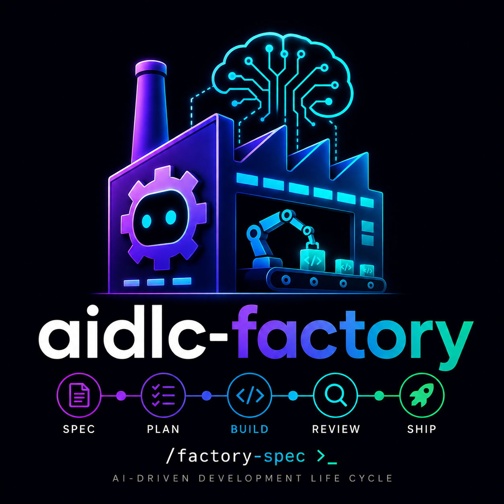

<p align="center">
<!-- ALL-CONTRIBUTORS-BADGE:START - Do not remove or modify this section -->
[](#contributors-)
<!-- ALL-CONTRIBUTORS-BADGE:END -->
  
</p>

<h1 align="center">AIDLC-Factory</h1>

<p align="center"><em>AI-Driven Development Life Cycle — the multi-agent factory.</em></p>

A multi-agent software-development workflow that takes a feature request from
specification → plan → code → review → ship, with human approval gates between
every stage and traceable artifacts at every step.

> [!IMPORTANT]
> Generative AI can make mistakes. Review every AI-generated artifact and
> associated cost before approving a stage.

This repository is based on **[AWS Labs aidlc-workflows](https://github.com/awslabs/aidlc-workflows)**
(core workflow rules at v0.1.8). Taking its inception → construction →
operations flow as a reference, this fork (v0.2.0) adds a multi-agent
orchestrator, a skills application layer, hallucination prevention, quality
gates, CodeGraph integration, persistent memory (Engram), a contract-validated
stage pipeline, and more.

---

## Table of Contents

- [Quick Start](#quick-start)
- [What This Is](#what-this-is)
- [Third-Party Components](#third-party-components)
- [Slash Commands Reference](#slash-commands-reference)
- [Working on this repo](#working-on-this-repo)
- [Installation](#installation)
- [Repository Layout](#repository-layout)
- [Adding Custom Skills](#adding-custom-skills)
- [Adding Custom Agents](#adding-custom-agents)
- [Configuration](#configuration)
- [Community](#community)
- [Troubleshooting](#troubleshooting)
- [License](#license)

---

## Quick Start

```bash
# One command — no cloning, no venv setup, no PyPI account needed:
pipx run aidlc-factory-installer --tool claude --dest /path/to/your/project

# Or with uv (Rust-based, even faster):
uvx aidlc-factory-installer --tool claude --dest /path/to/your/project

# Then open your agentic coding tool and run:
# /factory-onboarding
# /factory-spec "<your idea>"
```

No cloning, no venv, no `pip install`. Works anywhere Python 3.10+ is installed.
**Spec → Plan → Code → Review → Ship**, halting at each approval gate.

If you don't have `pipx` yet:
```bash
pip install pipx && pipx ensurepath
# Or: brew install pipx && pipx ensurepath
```

> **About the PyPI package:** `aidlc-factory-installer` on PyPI is a tiny (5 KB) bootstrap
> that downloads the latest AIDLC source from GitHub at runtime — the real
> installer, agents, contracts, and scripts stay on GitHub. This keeps the
> `pipx run` instant and the PyPI package minimal.

For users who prefer cloning the repo:
```bash
git clone <this-fork-url> && cd <repo>
python3 -m venv .venv && source .venv/bin/activate
pip install -r requirements.txt
python3 aidlc-scripts/install_aidlc.py
```

---

## What This Is

The orchestrator is activated through `/factory-*` slash commands and executes
**13 specialized stage subagents** with:

- **Contract-validated handoffs** — every stage input/output is JSON-Schema-validated against `.aidlc-orchestrator/contracts/*.v1.json`.
- **Parallel-safe codegen** — layered units run in parallel with file-glob locks and Python AST symbol-drift detection.
- **Parallel reviewer pool** — code / security / performance / simplifier reviewers run concurrently.
- **Persistent memory** — Engram captures decisions, ADRs, and conventions across sessions.
- **Codebase intelligence** — CodeGraph provides a semantic knowledge graph for impact analysis and dead-code detection.
- **Skills enforcement** — engineering process skills (testing, security, ADRs, etc.) are auto-attached per stage.
- **Auto-commit on approval** — explicit user approvals trigger git commits with stage-tagged messages.
- **Kill & resume** — interrupted runs resume from the last completed stage.
- **Adaptive requirements elicitation** — `requirements-intelligence` routes between four techniques (Socratic probing, ambiguity detection, assumption mining, pre-mortem) based on signals from the request. Enforces an 8-axis coverage map (Purpose / Needs / Limits / Expectations / Context / Risks / Acceptance / Unknowns) so no dimension goes unasked at the depth the request warrants. Weasel words are flagged and converted to quantifier MCQs; implicit assumptions are surfaced before they become spec bugs.
- **Design system enforcement** — `design-system-composer` composes UIs exclusively from `design-system/INDEX.md` primitives. After each generation slice `ui-constraint-validator` scans for hardcoded spacing, radius, typography, color, and elevation values and auto-corrects them to the nearest canonical token. Slices with >3 deviations are blocked for human review instead of silently producing non-compliant UI.
- **API hallucination elimination** — `validator-retry` runs static type-check and linter feedback in a loop after every code-generation unit. Compile errors caused by hallucinated APIs or wrong signatures are fed back to the generator for correction before the stage exits — not caught at runtime or by the user.
- **Curated, verified tool catalog** — `secret-knowledge` gives every stage agent a reference catalog of CLI tools, security toolkits, performance profilers, and shell one-liners sourced from the Book of Secret Knowledge. Every recommended command passes a verification gate (tool exists, syntax correct, platform-appropriate, no hallucinated URLs) to prevent fabricated tool names from reaching generated scripts.
- **Skills currency / anti-drift** — `factory_skill_sync.py` clones the local autoskills fork (`Mbg999/autoskills-for-aidlc-factory`), builds it, and runs the compiled CLI to install the latest framework-specific skills (Next.js, Angular, Express, Vue, Python, etc.) into `.agents/skills/`. The fork already handles monorepo scanning internally, so no per-workspace loop is needed. `factory_custom_skills.py` handles internal or private skills pinned by SHA-256 via `skill-sources.yaml`. Together they keep stage agents' knowledge of framework idioms and API conventions current — not frozen at model training time. Node ≥ 22.6 is required to build the TypeScript package; the script tries system Node, `fnm`, `volta`, and `nvm` in that order. If no compatible Node is found, the sync silently skips — pre-shipped skills still apply.
- **Library doc grounding (Context7 MCP)** — the installer ships a project-local MCP server entry for [Context7](https://github.com/upstash/context7), and a `library-docs-with-context7` custom skill routes every framework / SDK / CLI / cloud-service question through Context7's `resolve-library-id` → `query-docs` two-call protocol before falling back to WebFetch, WebSearch, or training-data recall. The skill is wired into `code-generator`, `build-test-agent`, and `reviewer-code` so subagents inherit the directive (MCP `instructions` blocks are session-level only).
- **Browser testing (Chrome DevTools MCP)** — the installer ships a project-local MCP server entry for [chrome-devtools-mcp](https://github.com/ChromeDevTools/chrome-devtools-mcp), giving the `browser-testing-with-devtools` skill a real driver for click / fill / screenshot / Lighthouse / network-trace operations during build-test and review stages.
- **Executor adapters** — `aidlc-scripts/executors/` implements a pluggable adapter pattern (`StageExecutor` base class) so the same orchestrator logic can spawn subagents on Claude Code (production), Cursor (stub), or OpenCode (stub). A `registry.yaml` maps `--tool` values to adapter implementations with declared capabilities (concurrency, worktree isolation, cancellation).
- **Security scanning stack** — six integrated scanners (gitleaks, semgrep, grype, bandit, checkov, clamav) run daily via CI and on every PR, covering secret detection, SAST, SCA, IaC scanning, and malware scanning.

The multi-agent orchestrator runs natively on **Claude Code, Cursor, GitHub
Copilot, OpenCode, and Codex** — each ships with its own stage subagent tree
(`.claude/agents/`, `.cursor/agents/`, `.github/agents/`, `.opencode/agents/`,
`.codex/agents/`) and the installer wires the matching slash-command / prompt
/ TOML directory for that tool. `--tool other` falls back to the legacy
single-agent workflow from upstream.

---

## Third-Party Components

This fork integrates several upstream and external projects. All are **opt-in**
at install time.

| Component | Source | What it provides | How it's installed |
|---|---|---|---|
| **AWS Labs AI-DLC** | [awslabs/aidlc-workflows](https://github.com/awslabs/aidlc-workflows) v0.1.8 | Core workflow rules in `aidlc-rules/` — the spec → plan → code → review → ship pipeline that this fork extends | Bundled in `aidlc-rules/` |
| **Agent Skills** | [addyosmani/agent-skills](https://github.com/addyosmani/agent-skills) | Engineering-process skills (TDD, security, ADRs, deprecation, performance, etc.) auto-attached per stage | `--with-agent-skills` (default on). Installed to `.agents/skills/` in the *destination* project. |
| **CodeGraph MCP** | [@colbymchenry/codegraph](https://www.npmjs.com/package/@colbymchenry/codegraph) (npm) | Local semantic code knowledge graph + MCP tools (`codegraph_search`, `codegraph_callers`, `codegraph_impact`, etc.) for 92% fewer tool calls and 71% faster context retrieval | `--with-codegraph` (requires Node ≥ 18) |
| **Engram** | Local persistent memory (MCP) | Cross-session memory: decisions, conventions, bug fixes, discoveries. Used by stage agents via `mem_save`, `mem_search`, etc. | `--with-engram` |
| **Context7 MCP** | [upstash/context7](https://github.com/upstash/context7) | Version-aware library / SDK / CLI documentation. Two-call protocol: `resolve-library-id` → `query-docs`. Subagents reach it via the `library-docs-with-context7` skill. | Bundled in per-tool MCP configs (`.mcp.json`, `.cursor/mcp.json`, `.vscode/mcp.json`, `opencode.json`, `codex.json`) referencing `npx -y @upstash/context7-mcp`. |
| **Chrome DevTools MCP** | [ChromeDevTools/chrome-devtools-mcp](https://github.com/ChromeDevTools/chrome-devtools-mcp) | Real Chrome driver for click / fill / screenshot / Lighthouse / network-trace / performance-trace from any stage agent. Backs the `browser-testing-with-devtools` skill. | Bundled in the same per-tool MCP configs (`npx -y chrome-devtools-mcp@latest`). |
| **Agentic coding tools** | Claude Code, Cursor, GitHub Copilot, OpenCode, Codex | Any of these can host the multi-agent orchestrator. Each tool's native subagent spawn primitive backs every stage spawn. | User-installed; the installer wires the tool-specific config (`.claude/`, `.cursor/`, `.github/`, `.opencode/`, or `.codex/`) |
| **Custom Skills (this fork)** | `.agents/custom-skills/` | 22 project-specific skills: `validator-retry`, `codegraph-aware-exploration`, `secret-knowledge`, `design-system-composer`, etc. | Bundled, copied automatically when the orchestrator is installed |
| **Design System (optional)** | `design-system/` + `design-system-composer` skill | Token-driven UI composition with hardcoded-value detection | `--with-design-system` (default on for UI projects) |
| **Google Stitch MCP** | [@_davideast/stitch-mcp](https://www.npmjs.com/package/@_davideast/stitch-mcp) (npm) | AI design-to-code: 15+ tools for design extraction, project management, dark mode, responsive variants. Backs the `design-system-composer` skill. | `--with-stitch-mcp` (requires Node ≥ 18, gcloud auth, `GOOGLE_CLOUD_PROJECT`) |
| **Figma MCP** | Official Figma Remote MCP at https://mcp.figma.com/mcp + community fallback `figma-mcp` (npm) | Design-to-code MCP bridge: 16+ tools (`get_design_context`, `use_figma`, `generate_figma_design`, etc.) for reading designs, extracting tokens, generating components. Backs the `design-system-composer` skill. | `--with-figma-mcp` (requires OAuth or `FIGMA_API_KEY`) |

> Every external dependency degrades gracefully. The orchestrator still runs
> if CodeGraph or Engram is missing — those stages just lose the corresponding
> intelligence.

---

## Slash Commands Reference

Commands are invoked from inside your agentic coding tool (Claude Code, Cursor,
GitHub Copilot, OpenCode, or Codex). They live in the tool-specific commands directory
(`.claude/commands/`, `.cursor/commands/`, `.github/prompts/`,
`.opencode/commands/`, or `.codex/config.toml` for Codex agents) and route through the orchestrator agent under that
tool's agents directory (`<tool>/agents/orchestrator.md`).

| Command | Phase | What it does |
|---|---|---|
| `/factory-onboarding` | Setup | Interactive walkthrough of the AIDLC orchestrator. Recommended first command for new users. |
| `/factory-help` | Setup | Full command reference and getting-started instructions. |
| `/factory-spec <feature>` | 0. Inception | Workspace detection + adaptive requirements analysis (two-pass — Q&A → spec). Produces `aidlc-docs/<run-id>-requirements.md`. |
| `/factory-plan <run-id>` | 1. Planning | Generates the execution plan, optional user stories/personas, and per-unit decomposition. |
| `/factory-product <feature>` | 0–1. Product | Combined run: workspace scout + requirements + personas + stories + execution plan. **Stops before code generation.** Useful for product-only iterations. |
| `/factory-build <run-id>` | 5. Construction | Per-unit code generation + build/test. Layer-parallel (independent units run concurrently, layers sequential). Includes file-glob locks and AST symbol-drift checks. |
| `/factory-review <run-id>` | 4. Review | Spawns the parallel reviewer pool: code quality, security, performance, simplification. Merges findings into a single report. |
| `/factory-ship <run-id>` | 6. Ship | Release notes, ADRs, CHANGELOG, version proposal, optional CI/CD wiring, deprecation/migration plan. |
| `/factory-state <run-id>` | Utility | Show run status: completed stages, current stage, next steps, budget, any blocking issues. |
| `/factory-resume <run-id>` | Recovery | Resume an interrupted run from its last checkpoint. |
| `/factory-replay <run-id> --from <stage>` | Recovery | Re-run from a specific stage. Rolls the manifest back and archives prior output handoffs. |
| `/factory-code-tour` | Exploration | Dependency-ordered tour of an unfamiliar codebase: foundations → entry points. |
| `/factory-self` | Meta | Run the AIDLC orchestrator **on its own codebase**. Use this to add features, fix bugs, or refactor the orchestrator scripts themselves. |

A complete spec → ship sequence typically looks like:

```
/factory-spec "<feature>"        → review + approve requirements
/factory-plan   <run-id>          → review + approve execution plan
/factory-build  <run-id>          → review + approve per-unit code
/factory-review <run-id>          → review + approve findings, apply fixes
/factory-ship   <run-id>          → release notes + ADRs
```

---

## Working on this repo

If you cloned this repo to **contribute to AIDLC itself** (rather than to
install AIDLC into another project), bootstrap the dev environment first:

```bash
python3 -m venv .venv
source .venv/bin/activate
pip install -r requirements.txt
```

Both `install_aidlc.py` and the test suite rely on packages from
`requirements.txt`. Without this step you'll see
`ModuleNotFoundError: No module named 'yaml'` (or similar) on first run.

Then verify the bootstrap:

```bash
pytest tests/
```

If green, you're ready to develop. If you're installing AIDLC into a
*downstream* project, skip ahead to `## Installation` — the installer
will create its own `.venv` in the destination automatically.

---

## Installation

### Prerequisites

- **Python 3.10+** (a `.venv` is created automatically by the installer)
- **Git** (auto-commit on approval requires a git repo in the destination)
- **Node ≥ 18** — only if installing CodeGraph (`--with-codegraph`). The bundled Context7 and Chrome DevTools MCP servers run via `npx` and inherit your tool's Node runtime at use-time (no install-time check).
- **Node ≥ 22.6 — optional, auto-bootstrapped** for `autoskills` framework-skill sync. `factory_skill_sync.py` clones the autoskills fork and compiles it locally, then runs the compiled CLI. If your system Node is older, the script tries `fnm`, `volta`, and `nvm` in that order (and runs `nvm install 22` once if nvm is available but Node 22 is missing). If no compatible Node is found, the sync silently skips — pre-shipped skills still apply. For greenfield projects, pass `--tech <list>` to force technologies (e.g. `--tech react,nextjs,python`).
- **An agentic coding tool** — Claude Code, Cursor, GitHub Copilot, or OpenCode. The multi-agent orchestrator runs natively on any of these. `--tool other` falls back to the legacy single-agent workflow.
- **Engram** — required for persistent cross-session memory. Install per your tool:
  - **Claude Code:** `claude plugin marketplace add Gentleman-Programming/engram && claude plugin install engram`
  - **OpenCode:** `engram setup opencode`
  - **Cursor / GitHub Copilot / others:** the installer writes an `.mcp.json` entry pointing at the `engram` MCP server (install the binary via the [Engram repo](https://github.com/Gentleman-Programming/engram))

> **Note for OpenCode users:** OpenCode has an additional Node.js dependency
> (`@opencode-ai/plugin`) tracked in `.opencode/package.json`. Run
> `npm install` inside `.opencode/` if you see plugin-related errors.

### Platform-specific setup

<details>
<summary><b>macOS</b></summary>

```bash
# Python 3.10+
brew install python@3.12

# Git (if not already present)
xcode-select --install

# Node.js 22+ — only needed for CodeGraph (--with-codegraph)
brew install node@22
```

</details>

<details>
<summary><b>Linux — Ubuntu / Debian</b></summary>

```bash
# Python 3.10+
sudo apt-get update
sudo apt-get install -y python3 python3-venv python3-pip

# Git
sudo apt-get install -y git

# Node.js 22+ — only needed for CodeGraph (--with-codegraph)
curl -o- https://raw.githubusercontent.com/nvm-sh/nvm/v0.40.1/install.sh | bash
source ~/.nvm/nvm.sh
nvm install 22 && nvm use 22
```

</details>

<details>
<summary><b>Linux — Fedora / RHEL / CentOS</b></summary>

```bash
# Python 3.10+
sudo dnf install python3 python3-pip

# Git
sudo dnf install git

# Node.js 22+ — only needed for CodeGraph (--with-codegraph)
sudo dnf install nodejs npm        # distro package (check version first)
# — or via nvm for the latest LTS:
curl -o- https://raw.githubusercontent.com/nvm-sh/nvm/v0.40.1/install.sh | bash
source ~/.nvm/nvm.sh
nvm install 22 && nvm use 22
```

</details>

<details>
<summary><b>Windows — PowerShell (run as Administrator)</b></summary>

```powershell
# Python 3.10+
winget install Python.Python.3.12

# Git
winget install Git.Git

# Node.js 22+ — only needed for CodeGraph (--with-codegraph)
winget install OpenJS.NodeJS.LTS
```

> [!NOTE]
> On Windows the installer tries the `py` launcher (Python Launcher for Windows),
> `python`, and `python3` in that order for virtual-environment creation, so any
> standard Python 3.10+ install will work.
>
> Open a **new** terminal after running `winget` commands so the updated `PATH`
> takes effect.

</details>

---

### One-line install (pipx/uvx — recommended)

```bash
pipx run aidlc-factory-installer --tool claude --dest /path/to/your/project

# Or with uv (Rust-based, faster cold start):
uvx aidlc-factory-installer --tool claude --dest /path/to/your/project
```

No cloning, no venv setup, no `pip install`. The `aidlc-factory-installer` PyPI package
is a 5 KB bootstrap that downloads the latest AIDLC source from GitHub at
runtime and delegates to the real installer.

### Traditional install (local clone)

```bash
git clone https://github.com/Mbg999/aidlc-factory.git
cd aidlc-factory
python3 -m venv .venv && source .venv/bin/activate
pip install -r requirements.txt
python3 aidlc-scripts/install_aidlc.py \
    --tool <claude|cursor|copilot|opencode|codex> \
    --dest /path/to/your/project \
    --with-agent-skills \
    --with-codegraph \
    --with-engram \
    --yes
```

### Installer flags

| Flag | Default | What it controls |
|---|---|---|
| `--tool <name>` | required | `cursor`, `claude`, `copilot`, `opencode`, `codex`, `other`. Comma-separate for multiple. |
| `--dest <path>` | `.` (cwd) | Project to install into. |
| `--source <path>` | packaged | Override the rules source (advanced). |
| `--with-agent-skills` | on | Install the engineering-process skills from `addyosmani/agent-skills`. |
| `--agent-skills-path <path>` | — | Use a local clone instead of cloning fresh. |
| `--custom-skills-path <path>` | — | Add project-specific skills. Each subdirectory needs a `SKILL.md`. Overrides agent-skills with the same name. |
| `--with-orchestrator` / `--no-orchestrator` | prompt | Install the multi-agent orchestrator. Effective for `claude`, `cursor`, `copilot`, `opencode`, `codex`. |
| `--with-codegraph` | off | Install CodeGraph npm package + write `.mcp.json`. |
| `--with-engram` | off | Set up Engram persistent memory. CLI tools get the tool-specific command; MCP tools get an `.mcp.json` entry. |
| `--with-design-system` | on | Install design-system tokens + UI skills. |
| `--with-stitch-mcp` | off | Install Google Stitch MCP server config (`@_davideast/stitch-mcp`). Requires Node ≥ 18, gcloud auth, and `GOOGLE_CLOUD_PROJECT`. |
| `--with-figma-mcp` | off | Install Figma MCP server config (official Figma Remote MCP + community fallback). Requires Figma account, OAuth or `FIGMA_API_KEY`. |
| `--force` | off | Re-install / upgrade. Overwrites orchestrator files; preserves run state (`runs/`, `knowledge/`). |
| `--no-venv` | off | Skip creating `.venv` and installing `requirements.txt`. |
| `--dry-run` | off | Print planned actions without writing files. |
| `--yes` | off | Skip all interactive prompts. |

### What gets installed

The tree below uses Claude Code paths as an example. The agent + commands
directories vary per `--tool`:

| Tool | Agents dir | Commands / prompts dir | Workflow doc | MCP config |
|---|---|---|---|---|
| `claude` | `.claude/agents/` | `.claude/commands/` | `CLAUDE.md` | `.mcp.json` (`mcpServers`) |
| `cursor` | `.cursor/agents/` | `.cursor/commands/` | — | `.cursor/mcp.json` (`mcpServers`) |
| `copilot` | `.github/agents/` | `.github/prompts/` | `.github/copilot-instructions.md` | `.vscode/mcp.json` (`servers`) |
| `opencode` | `.opencode/agents/` | `.opencode/commands/` | `AGENTS.md` | `opencode.json` (`mcp` / `type: local`) |
| `codex` | `.codex/agents/` | `.codex/config.toml` | `AGENTS.md` | `codex.json` (`mcp` / `type: local`) |

> **MCP servers shipped in this repo:** The per-tool MCP configs include two
> servers by default — `@upstash/context7-mcp` (library docs) and
> `chrome-devtools-mcp@latest` (browser driver). When `--with-stitch-mcp` is set,
> Google Stitch MCP is added; when `--with-figma-mcp` is set, the Figma MCP entry
> is added; CodeGraph and Engram get their own MCP entries when
> `--with-codegraph` / `--with-engram` are used. The installer never overwrites
> an existing config — use `--force` to replace.

Everything outside the per-tool block is shared across all five tools.

```
<project>/
├── aidlc-rules/                       # Upstream AWS AIDLC workflow rules (v0.1.8)
├── .agents/
│   ├── skills/                        # Engineering skills from --with-agent-skills (created at install)
│   └── custom-skills/                 # 22 fork-specific skills (highest priority)
├── <tool>/                            # Per-tool orchestrator wiring (see table above)
│   ├── agents/
│   │   ├── orchestrator.md            # Multi-agent orchestrator entry point
│   │   ├── stage/                     # 13 stage subagents
│   │   ├── cross-cutting/             # conflict-resolver, knowledge-agent
│   │   └── custom/                    # Your custom agents (commit to repo)
│   └── commands/ (or prompts/ or config.toml)  # 13 /factory-* slash commands, prompt files, or Codex TOML config
├── .aidlc-orchestrator/
│   ├── runtime/                       # 24 architecture & procedure docs
│   ├── contracts/                     # 31 JSON Schema handoff + protocol entries
│   ├── budgets/default.yaml           # Per-stage model assignments + concurrency + feature flags
│   ├── runs/                          # Per-run state (gitignored)
│   └── knowledge/                     # Project-scoped knowledge store (gitignored)
├── aidlc-scripts/
│   ├── install_aidlc.py               # The installer itself
│   ├── factory_*.py                   # ~38 runtime scripts
│   ├── skill_utils.py                 # Skills utility library
│   ├── executors/                     # Pluggable executor adapters (claude-code, cursor, opencode, codex)
│   └── VERSION                        # Orchestrator scripts version (currently 0.2.0)
├── design-system/                     # Token-driven UI design system (INDEX.md, tokens, primitives, patterns)
├── aidlc-docs/                        # Generated artifacts from AIDLC runs
├── .codegraph/                        # CodeGraph index (gitignored, regenerated)
├── .engram/                           # Engram persistent memory store (gitignored)
├── .github/
│   ├── workflows/                     # 8 CI/CD workflows
│   ├── ISSUE_TEMPLATE/                # 5 issue templates
│   ├── CODEOWNERS                     # Ownership rules
│   └── pull_request_template.md       # PR template
├── .mcp.json                          # MCP server registrations (context7 + chrome-devtools)
├── .cursor/mcp.json                   # Same servers, Cursor format (when --tool cursor)
├── .vscode/mcp.json                   # Same servers, VS Code/Copilot format (when --tool copilot)
├── opencode.json                      # Same servers, OpenCode format (when --tool opencode)
├── codex.json                         # Same servers, Codex format (when --tool codex)
├── .bandit, .checkov.yaml, .gitleaks.toml, .grype.yaml, .semgrepignore  # Security scanner configs
├── .pre-commit-config.yaml            # Markdownlint pre-commit hook
├── skill-sources.yaml                 # SHA-256 pinned custom/private skill registry
├── cliff.toml                         # Git-cliff changelog generation config
├── CHANGELOG.md                       # Release history
├── docs/                              # Supporting docs (working-with-aidlc, troubleshooting, dev guide, admin guide)
└── .venv/                             # Python virtual environment
```

### Verify the install

```bash
# Check orchestrator is wired
python3 aidlc-scripts/factory_validate.py

# List discovered agents (built-in + custom)
python3 aidlc-scripts/factory_agent_discover.py list

# Verify autoskills resolver
python3 aidlc-scripts/factory_custom_skills.py --dry-run

# Inside your agentic coding tool (Claude Code, Cursor, Copilot Chat, OpenCode):
/factory-help
/factory-onboarding
```

---

## Repository Layout

| Path | Purpose |
|---|---|
| `aidlc-rules/aws-aidlc-rules/core-workflow.md` | Stage workflow rules read by all stage agents (upstream v0.1.8) |
| `aidlc-rules/aws-aidlc-rule-details/` | Detailed per-stage rules (inception / construction / operations / extensions) |
| `aidlc-rules/adapters/` | Tool-specific adapter docs (Claude Code, Cursor, Copilot, OpenCode, Codex, generic) |
| `.claude/`, `.cursor/`, `.github/`, `.opencode/`, `.codex/` | Per-tool agent + commands trees (kept in parity — same orchestrator, stages, and cross-cutting agents; frontmatter differs per tool) |
| `<tool>/agents/orchestrator.md` | Multi-agent orchestrator entry point |
| `<tool>/agents/stage/` | 13 stage subagents (workspace-scout, requirements-analyst, workflow-planner, story-writer, unit-decomposer, code-generator, build-test-agent, reviewer-{code,security,performance,simplifier}, ship-agent, reverse-engineer) |
| `<tool>/agents/cross-cutting/` | `conflict-resolver`, `knowledge-agent` |
| `<tool>/agents/custom/` | Your custom subagents (auto-discovered) |
| `<tool>/commands/` (or `.github/prompts/`) | 13 `/factory-*` slash command / prompt definitions |
| `.aidlc-orchestrator/runtime/` | 24 architecture docs: `index.md` (entry point), `spawn-loop.md`, `fast-path.md`, `recovery.md`, `compaction.md`, `visual-feedback.md`, `ui-compiler.md`, `design-system.md`, `cmd-factory-product.md`, `project-profile.md`, `custom-subagents.md`, `extension-loading.md`, `skill-protocol.md`, `knowledge-agent.md`, `conflict-resolver.md`, etc. |
| `.aidlc-orchestrator/contracts/` | 31 entries — JSON Schema stage I/O handoffs, approval schema, audit-block protocol, executor contract, harness schemas, shared schemas, plus `README.md` and `REFERENCE.md` |
| `.aidlc-orchestrator/budgets/default.yaml` | Per-stage model assignments, concurrency limits, feature flags |
| `.agents/custom-skills/` | 22 fork-specific skills (highest priority in skill resolution) |
| `aidlc-scripts/` | ~38 `factory_*.py` runtime scripts + `install_aidlc.py` + `skill_utils.py` |
| `aidlc-scripts/executors/` | Pluggable executor adapter implementations: `base.py` (abstract), `claude_code_executor.py` (production), `cursor_executor.py`, `opencode_executor.py`, `codex_executor.py` (stubs), `registry.yaml`, `runner.py` |
| `aidlc-scripts/VERSION` | Orchestrator scripts version (0.2.0) |
| `aidlc-rules/VERSION` | Upstream rules version (0.1.8) |
| `design-system/` | Token-driven UI design system: `INDEX.md`, `tokens/`, `primitives/`, `patterns/`, `anti-patterns/`, `examples/`, `screenshots/` |
| `aidlc-docs/` | Generated artifacts from AIDLC runs |
| `docs/` | Supporting documentation: `WORKING-WITH-AIDLC.md`, `TROUBLESHOOTING.md`, `DEVELOPERS_GUIDE.md`, `ADMINISTRATIVE_GUIDE.md`, `GENERATED_DOCS_REFERENCE.md`, `writing-inputs/` |
| `tests/` | Pytest suite |
| `.github/workflows/` | 8 CI/CD workflows |
| `.github/ISSUE_TEMPLATE/` | 5 issue templates + `labeler.yml` |
| `skill-sources.yaml` | SHA-256 pinned registry for custom/private skills (read by `factory_custom_skills.py`) |
| `cliff.toml` | Git-cliff changelog generation config (Conventional Commits) |
| `.pre-commit-config.yaml` | Markdownlint pre-commit hook |
| `.bandit`, `.checkov.yaml`, `.gitleaks.toml`, `.grype.yaml`, `.semgrepignore` | Security scanner configuration files |

---

## Adding Custom Skills

A **skill** is a reusable, scoped instruction set that stage agents auto-attach.
Examples: enforce TDD, run a specific linter, follow a security checklist,
validate design tokens.

### Resolution order

When a stage requests a skill, the resolver checks (first found wins):

1. `.agents/custom-skills/<name>/SKILL.md` — project-specific (highest priority)
2. `.agents/skills/<name>/SKILL.md` — installed via `--with-agent-skills` (created at install time in the destination project)
3. `~/.agents/skills/<name>/SKILL.md` — user-global fallback

### Built-in custom skills (this fork)

| Skill | What it does |
|---|---|
| `code-review-and-quality` | Multi-axis code review with auto-fix and build |
| `validator-retry` | Static type/lint validator with compile-error feedback retry loop — eliminates hallucinated APIs |
| `codegraph-aware-exploration` | Prefer `codegraph_*` MCP tools over grep/glob when `.codegraph/` exists |
| `library-docs-with-context7` | Route every library / SDK / CLI / cloud-service question through the Context7 MCP server (`resolve-library-id` → `query-docs`) before WebFetch, WebSearch, or training-data recall. Wired into `code-generator`, `build-test-agent`, `reviewer-code`. |
| `design-system-composer` | Compose UIs from `INDEX.md` primitives; never invent tokens |
| `ui-constraint-validator` | Scan generated UI for hardcoded values and snap to design tokens |
| `environment-detection` | Detect-before-install discipline for runtimes and package managers |
| `requirements-intelligence` | Adaptive elicitation engine for the Requirements Analyst stage |
| `secret-knowledge` | Curated reference catalog of CLI tools, security toolkits, one-liners |
| `security-and-hardening` | OWASP-aware security review patterns |
| `performance-optimization` | Hot-path analysis, allocation review, complexity checks |
| `test-driven-development` | TDD enforcement: tests first, then code |
| `documentation-and-adrs` | ADR templates + documentation conventions |
| `shipping-and-launch` | Release notes, CHANGELOG, version-bump rules |
| `deprecation-and-migration` | Safe deprecation patterns + migration plans |
| `debugging-and-error-recovery` | Recovery patterns for failed stages |
| `git-workflow-and-versioning` | Conventional commits, branch strategy, rebase rules |
| `ci-cd-and-automation` | CI/CD pipeline patterns |
| `code-simplification` | Anti-over-engineering review patterns |
| `spec-driven-development` | Spec-first methodology |
| `planning-and-task-breakdown` | Decomposition heuristics |
| `browser-testing-with-devtools` | Chrome DevTools MCP patterns |

### Create a new custom skill

```bash
mkdir -p .agents/custom-skills/my-skill
cat > .agents/custom-skills/my-skill/SKILL.md <<'EOF'
---
name: my-skill
description: One-line description used by the resolver to match relevance.
type: process
---

# My Skill

## When to use
- Trigger condition 1
- Trigger condition 2

## How to apply
1. Step one
2. Step two

## Reference
- Link to internal doc or external standard
EOF
```

The skill is picked up automatically on the next stage run. To verify:

```bash
python3 aidlc-scripts/factory_custom_skills.py --dry-run | grep my-skill
```

### Private/custom skill registry

For skills not in the public autoskills registry, add entries to
`skill-sources.yaml` with name, raw URL, and SHA-256 pin:

```yaml
sources:
  - name: my-internal-skill
    url: https://example.com/skills/my-skill/SKILL.md
    sha256: "abcdef1234567890..."
```

Then install with:

```bash
python3 aidlc-scripts/factory_custom_skills.py --skill my-internal-skill
```

### Commit custom skills to the repo

```gitignore
# In .gitignore — keep these committed
!.agents/custom-skills/
```

---

## Adding Custom Agents

Custom agents are subagents the orchestrator can spawn alongside the built-in
stages. Examples: lint auditor, compliance reviewer, legal-doc checker,
performance profiler.

### Create a custom agent

Replace `<tool>` with your tool's agents directory: `.claude/agents`,
`.cursor/agents`, `.github/agents`, `.opencode/agents`, or `.codex/agents`.

```bash
mkdir -p <tool>/agents/custom
cat > <tool>/agents/custom/my-agent.md <<'EOF'
---
description: One-line description of what the agent does.
model: sonnet
---

# My Custom Agent

## Role
Describe the agent's responsibility.

## Inputs
- What it reads from the input handoff.

## Outputs
- What it writes to the output handoff.

## Process
1. Step one
2. Step two
EOF
```

The filename (without `.md`) becomes the agent name. Frontmatter requirements
differ per tool:

- **Claude Code:** `description`, `model` (`haiku` / `sonnet` / `opus`)
- **Cursor:** `model: inherit`, plus `readonly` / `is_background` flags
- **GitHub Copilot:** `description`, `tools` allowlist
- **OpenCode:** add `mode: subagent` and a `permission` block

If you want the same custom agent available in every tool, drop a copy under
each tool's `agents/custom/` directory (the file body can be identical; only
frontmatter differs).

### Discover and invoke

```bash
# List all discovered agents (built-in + custom)
python3 aidlc-scripts/factory_agent_discover.py list

# Show one agent's metadata
python3 aidlc-scripts/factory_agent_discover.py show my-agent
```

Inside the orchestrator, the agent is spawned with generic contracts at
`.aidlc-orchestrator/contracts/custom-agent.input.v1.json` and
`custom-agent.output.v1.json`:

```python
Task(subagent_type="custom/my-agent", prompt="<input-handoff-yaml-path>")
```

### Default model assignment

Custom agents default to `sonnet` (configured in `.aidlc-orchestrator/budgets/default.yaml`
under the `custom-agent` key). Override per-agent by adding an explicit entry.

### Built-in custom agent example

`lint-audit` ships in each tool's `agents/custom/` directory (`.claude/`,
`.cursor/`, `.github/`, `.opencode/`, `.codex/`) — it runs the project's linter and
reports violations without modifying files. Use it as a template.

### Commit custom agents to the repo

```gitignore
# In .gitignore — keep these committed
!.claude/agents/custom/
!.cursor/agents/custom/
!.github/agents/custom/
!.opencode/agents/custom/
!.codex/agents/custom/
```

---

## Configuration

### Environment variables

| Variable | Purpose | Example |
|---|---|---|
| `AIDLC_ROOT` | Override the repo root used by factory scripts. Defaults to the parent of `aidlc-scripts/`. | `AIDLC_ROOT=/path/to/repo python3 aidlc-scripts/factory_validate.py` |
| `AIDLC_MODEL_<STAGE>` | Override the model for a specific stage. Uppercase stage name with dashes → underscores. | `AIDLC_MODEL_CODE_GENERATOR=opus` |
| `AIDLC_FEATURE_<KEY>` | Override a feature flag from `default.yaml`. | `AIDLC_FEATURE_CONTENT_VALIDATOR_STRICT=true` |

### Per-stage model assignments

Edit `.aidlc-orchestrator/budgets/default.yaml`:

```yaml
concurrency:
  max_parallel: 4

per_stage:
  # Models are Claude Code shorthand (sonnet/opus/haiku).
  # Cursor ignores these — it uses `model: inherit` in .cursor/agents frontmatter.
  workspace-scout:        { model: "sonnet" }
  reverse-engineer:       { model: "sonnet" }
  requirements-analyst:   { model: "opus" }
  story-writer:           { model: "sonnet" }
  workflow-planner:       { model: "opus" }
  unit-decomposer:        { model: "sonnet" }
  code-generator:         { model: "opus" }
  build-test-agent:       { model: "sonnet" }
  reviewer-code:          { model: "sonnet" }
  reviewer-security:      { model: "sonnet" }
  reviewer-performance:   { model: "sonnet" }
  reviewer-simplifier:    { model: "sonnet" }
  ship-agent:             { model: "sonnet" }
  custom-agent:           { model: "sonnet" }
```

Feature flags in the same file control gating behaviour (content validation
strict mode, SLO-breach blocking, knowledge promotion, shared corpus injection).

### Auto-commit on approval

When the user explicitly approves a stage (signals: `approve`, `go ahead`,
`continue`, `lgtm`, `dale`, `sí`, etc.), the orchestrator stages and commits
the produced artifacts with a stage-tagged message. Commits never fire on a
stage's internal `status: complete` — only on explicit user approval.

To opt out, remove the `auto_commit_on_approval: true` line from
`.aidlc-orchestrator/runtime/run-manager.md`.

---

## Community

The repository includes standard open-source community files:

| File | Purpose |
|---|---|
| `CHANGELOG.md` | Release history (generated via `cliff.toml` using git-cliff) |
| `CONTRIBUTING.md` | Guidelines for contributions |
| `CODE_OF_CONDUCT.md` | Standards for community interaction |
| `NOTICES.md` | Third-party attribution and modification notes |
| `docs/DEVELOPERS_GUIDE.md` | Deep-dive developer documentation |
| `docs/ADMINISTRATIVE_GUIDE.md` | Operations and administration reference |

---

## Troubleshooting

### `python3 -m pytest` returns "No tests collected"

A shell wrapper may be intercepting `python3`. Invoke the venv binary directly:

```bash
./.venv/bin/python -m pytest tests/
```

### CodeGraph tools time out or return "index not ready"

```bash
# Re-index the workspace
codegraph init -i

# Verify status
codegraph_status   # via MCP inside the agent
```

### `/factory-resume` says "no run to resume"

Runs are stored in `.aidlc-orchestrator/runs/<run-id>/manifest.yaml`. List them:

```bash
ls .aidlc-orchestrator/runs/
python3 aidlc-scripts/factory_run.py list
```

### Stage spawn fails with "contract validation failed"

The stage produced an output handoff that doesn't validate against its
`.v1.json` schema. Read the validator output, then either:

- Re-run the stage: `/factory-replay <run-id> --from <stage>`
- Edit the output handoff manually and re-validate: `python3 aidlc-scripts/factory_validate.py <run-id>`

### Skill not being applied

Check resolution order and the autoskills resolver:

```bash
python3 aidlc-scripts/factory_custom_skills.py --dry-run
python3 aidlc-scripts/factory_skill_drift.py --report
```

### Engram memory tools not found

```bash
# Reinstall with --with-engram (substitute your tool: claude, cursor, copilot, opencode, codex)
python3 aidlc-scripts/install_aidlc.py --tool <tool> --dest . --with-engram --force
```

### MCP server not starting

Verify the MCP config has the expected servers. This repo ships with only
`context7` and `chrome-devtools` by default — codegraph, engram, stitch,
and figma entries are added by the installer at `--with-*` time:

```bash
python3 -m json.tool .mcp.json
```

---

## License

This project is licensed under the **Apache License, Version 2.0**. See
[`LICENSE`](LICENSE).

Portions of this work derive from [AWS Labs aidlc-workflows](https://github.com/awslabs/aidlc-workflows)
(Copyright Amazon.com, Inc. or its affiliates) originally distributed under
the MIT No Attribution License. Those portions remain available under MIT-0;
the combined work is distributed under Apache-2.0 as permitted by MIT-0.

Third-party components ([`agent-skills`](https://github.com/addyosmani/agent-skills),
[`codegraph`](https://www.npmjs.com/package/@colbymchenry/codegraph), Engram,
and the supported agentic coding tools — Claude Code, Cursor, GitHub Copilot,
OpenCode, Codex) are governed by their respective upstream licenses.

Full third-party attribution and modification notes are in [`NOTICES.md`](NOTICES.md).

---

## Contributors

<a href="https://github.com/Mbg999/aidlc-factory/graphs/contributors">
<!-- ALL-CONTRIBUTORS-LIST:START - Do not remove or modify this section -->
<!-- prettier-ignore-start -->
<!-- markdownlint-disable -->
<table>
  <tbody>
    <tr>
      <td align="center" valign="top" width="14.28%"><a href="https://github.com/Mbg999"><br /><sub><b>Miguel Belmonte Granados</b></sub></a><br /><a href="https://github.com/Mbg999/aidlc-factory/commits?author=Mbg999" title="Code">💻</a> <a href="https://github.com/Mbg999/aidlc-factory/commits?author=Mbg999" title="Documentation">📖</a> <a href="#design-Mbg999" title="Design">🎨</a></td>
      <td align="center" valign="top" width="14.28%"><a href="https://github.com/sftpruebas12"><br /><sub><b>sftpruebas12</b></sub></a><br /><a href="https://github.com/Mbg999/aidlc-factory/commits?author=sftpruebas12" title="Code">💻</a> <a href="https://github.com/Mbg999/aidlc-factory/commits?author=sftpruebas12" title="Documentation">📖</a></td>
      <td align="center" valign="top" width="14.28%"><a href="https://github.com/softtek030226-dev"><br /><sub><b>softtek030226-dev</b></sub></a><br /><a href="https://github.com/Mbg999/aidlc-factory/commits?author=softtek030226-dev" title="Code">💻</a> <a href="https://github.com/Mbg999/aidlc-factory/commits?author=softtek030226-dev" title="Documentation">📖</a></td>
      <td align="center" valign="top" width="14.28%"><a href="https://github.com/ccarluq0911"><br /><sub><b>Carlos Carrasquer</b></sub></a><br /><a href="https://github.com/Mbg999/aidlc-factory/commits?author=ccarluq0911" title="Code">💻</a> <a href="https://github.com/Mbg999/aidlc-factory/commits?author=ccarluq0911" title="Documentation">📖</a></td>
    </tr>
  </tbody>
</table>

<!-- markdownlint-restore -->
<!-- prettier-ignore-end -->