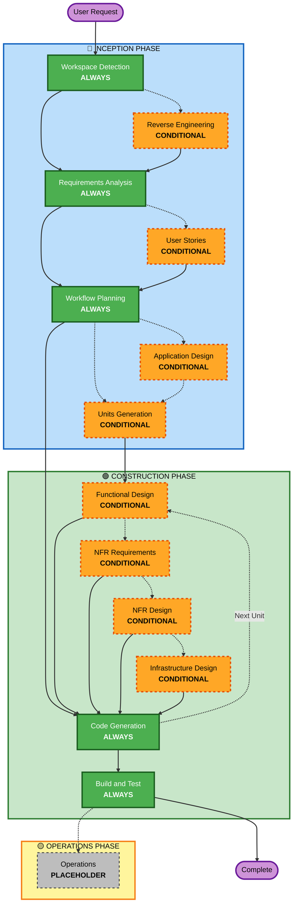

# AI-DLC Adaptive Workflow Overview

**Purpose**: Technical ref for AI and devs to understand workflow.

## The Three-Phase Lifecycle:
- **INCEPTION PHASE**: Planning & architecture (Workspace Detection + conditional phases + Workflow Planning)
- **CONSTRUCTION PHASE**: Design, implement, build & test (per-unit design + Code Generation + Build & Test)
- **OPERATIONS PHASE**: Placeholder for future deploy & monitoring

## The Adaptive Workflow:
- **Workspace Detection** (always) → **Reverse Engineering** (brownfield only) → **Requirements Analysis** (always, adaptive depth) → **Conditional Phases** (as needed) → **Workflow Planning** (always) → **Code Generation** (always, per-unit) → **Build and Test** (always)

## How It Works:
- AI analyzes request, workspace, complexity → pick needed stages
- Always: Workspace Detection; Requirements Analysis (adaptive); Workflow Planning; Code Generation (per-unit); Build & Test
- Conditional: Reverse Eng, User Stories, App Design, Units Generation, per-unit design (Functional, NFR Req, NFR Design, Infra Design)
- No fixed sequence — run stages in logical order per task

## Your Team's Role:
- Answer questions in dedicated question files using [Answer]: tags (A, B, C, D, E)
- Option E = Other — describe custom response
- Review & approve each phase as team
- Decide architecture collectively when needed
- Team effort — involve stakeholders per phase

## AI-DLC Three-Phase Workflow:

**Stage Descriptions:**

**🔵 INCEPTION PHASE** - Planning and Architecture
- Workspace Detection: Analyze workspace state & project type (ALWAYS)
- Reverse Engineering: Analyze existing codebase (CONDITIONAL - Brownfield only)
- Requirements Analysis: Gather & validate requirements (ALWAYS - adaptive depth)
- User Stories: Create user stories & personas (CONDITIONAL)
- Workflow Planning: Create execution plan (ALWAYS)
- Application Design: High-level component identification & service-layer design (CONDITIONAL)
- Units Generation: Decompose into units of work (CONDITIONAL)

**🟢 CONSTRUCTION PHASE** - Design, Implementation, Build and Test
- Functional Design: Business-logic design per unit (CONDITIONAL, per-unit)
- NFR Requirements: Define NFRs & pick tech stack (CONDITIONAL, per-unit)
- NFR Design: Add NFR patterns & logical components (CONDITIONAL, per-unit)
- Infrastructure Design: Map to infra services (CONDITIONAL, per-unit)
- Code Generation: Generate code (Planning → Generation) (ALWAYS, per-unit)
- Build and Test: Build units & run tests (ALWAYS)

**🟡 OPERATIONS PHASE** - Placeholder
- Operations: Placeholder for future deploy & monitoring workflows (PLACEHOLDER)

**Key Principles:**
- Run phases only when they add value
- Evaluate phases independently
- INCEPTION = what + why
- CONSTRUCTION = how + build & test
- OPERATIONS = placeholder for future
- Simple changes may skip conditional INCEPTION steps
- Complex changes get full INCEPTION + CONSTRUCTION

## Glossary

| Term | Meaning |
|------|---------|
| **Phase** | High-level lifecycle bucket: INCEPTION, CONSTRUCTION, OPERATIONS |
| **Stage** | Individual activity within a phase (e.g., Code Generation) |
| **Unit of Work** | Logical story grouping for planning/decomposition |
| **Service** | Independently deployable component (microservices) |
| **Module** | Logical grouping inside a service/monolith |
| **Component** | Reusable building block (class, function, package) |
| **Planning** | Create plans with questions + checkboxes for approval |
| **Generation** | Execute approved plans to produce artifacts |
| **NFR** | Non-Functional Requirements |
| **AI-DLC** | AI-Driven Development Life Cycle |

**Terminology rules**: Use "phase" for INCEPTION/CONSTRUCTION/OPERATIONS; "stage" for activities within phases. Never say "Requirements phase" (it's a stage) or "CONSTRUCTION stage" (it's a phase).